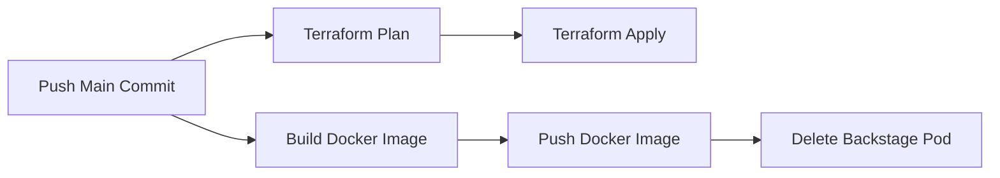
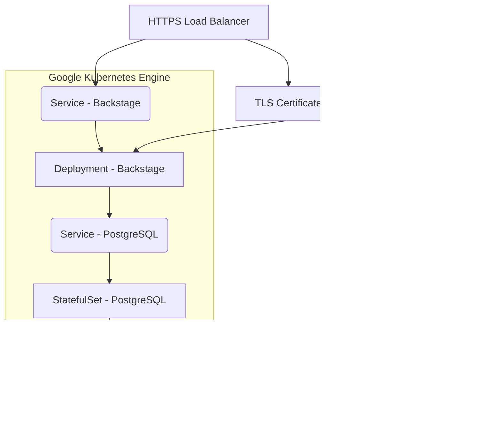

# Backstage

> Enabling developer autonomy, one plugin at a time

## Architecture

### Build and Deploy

```mermaid
flowchart LR
  pushMain["Push Main Commit"]

  terraformPlan["Terraform Plan"]
  terraformApply["Terraform Apply"]

  buildContainer["Build Docker Image"]
  pushContainer["Push Docker Image"]
  deletePod["Delete Backstage Pod"]

  pushMain --> terraformPlan
  terraformPlan --> terraformApply

  pushMain --> buildContainer
  buildContainer --> pushContainer
  pushContainer --> deletePod
```

### Infrastructure

```mermaid
flowchart TD
  gcpLB["HTTPS Load Balancer"]
  certificate["TLS Certificate"]
  artifactRegistry["Artifact Registry"]

  subgraph gke["Google Kubernetes Engine"]
    backstageDeploy["Deployment - Backstage"]
    backstageSvc("Service - Backstage")
    postgresqlSvc("Service - PostgreSQL")
    postgresqlSts["StatefulSet - PostgreSQL"]
    postgresqlPvc["Persistent Volume Claim - PostgreSQL"]
  end

  gcpLB --> certificate
  gcpLB --> backstageSvc
  backstageSvc --> backstageDeploy
  artifactRegistry --> backstageDeploy
  backstageDeploy --> postgresqlSvc
  postgresqlSvc --> postgresqlSts
  postgresqlSts --> postgresqlPvc
```
